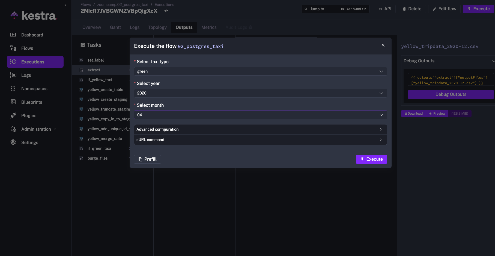
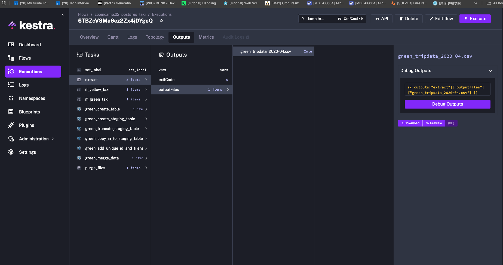
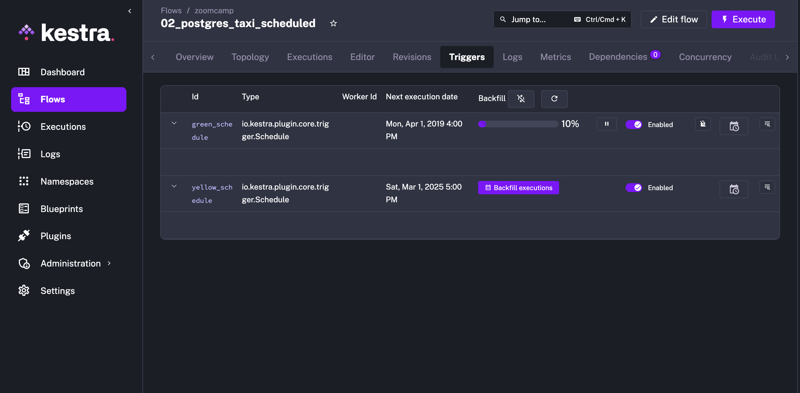
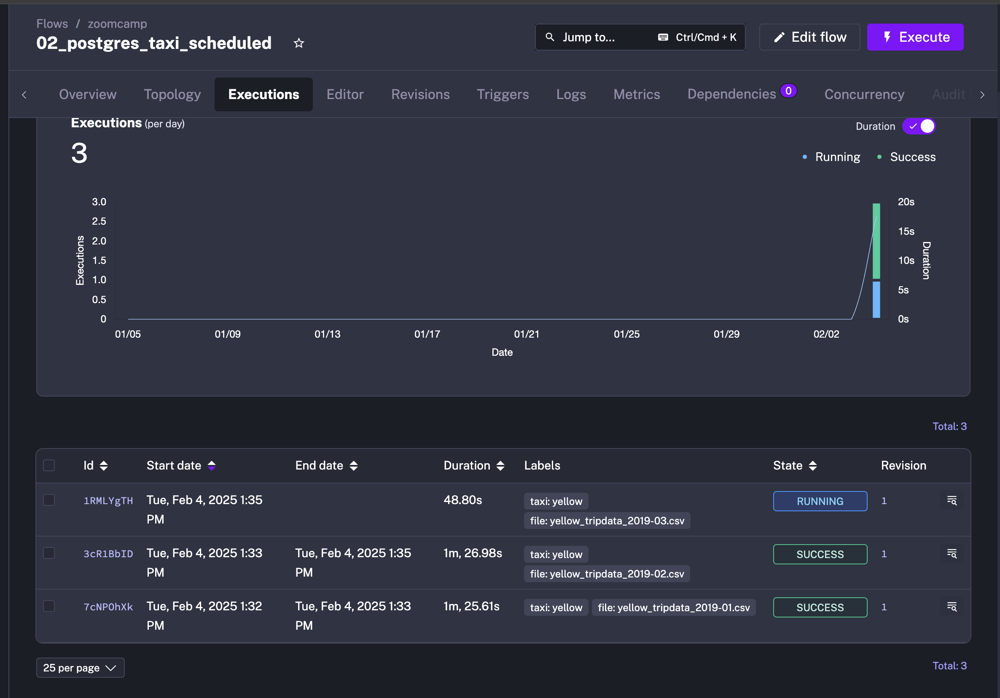
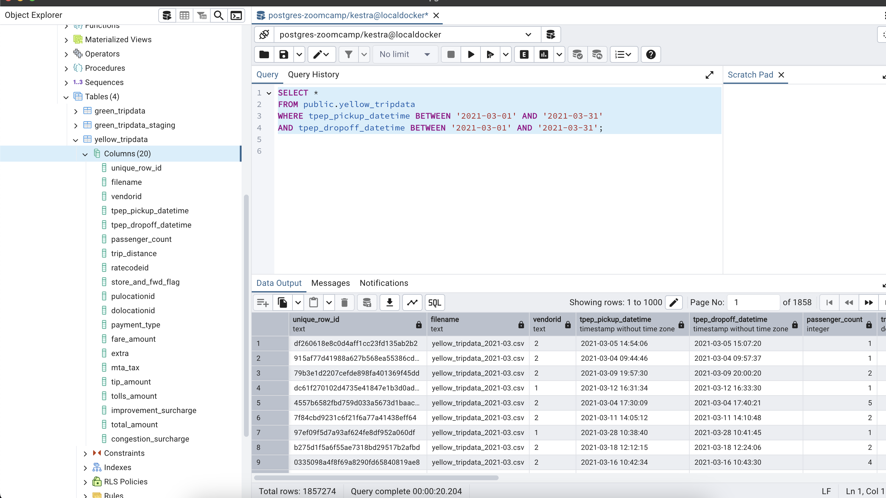
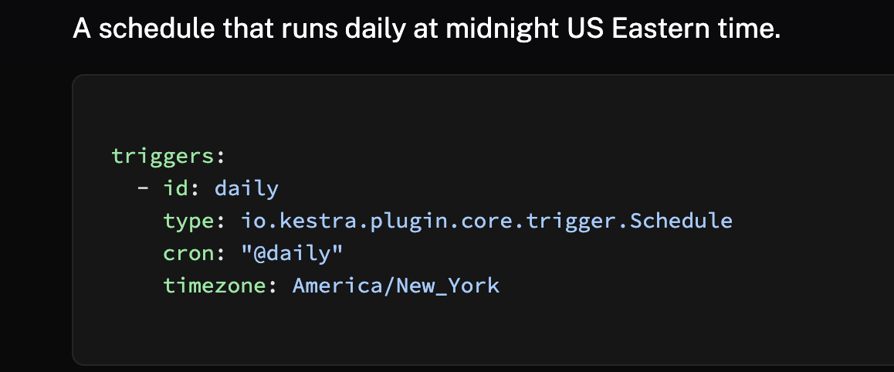

Question 1:

I checked the file size while it's running the pipeline.

Question 2:

Question 3, 4 and 5:

For question 3, 4 and 5, all the taxi data are added from backfill as the following.

And then, I tried to run sql query on pgAdmin and picked the closet result.

Question 6:

Reference Link: https://kestra.io/docs/workflow-components/triggers/schedule-trigger

